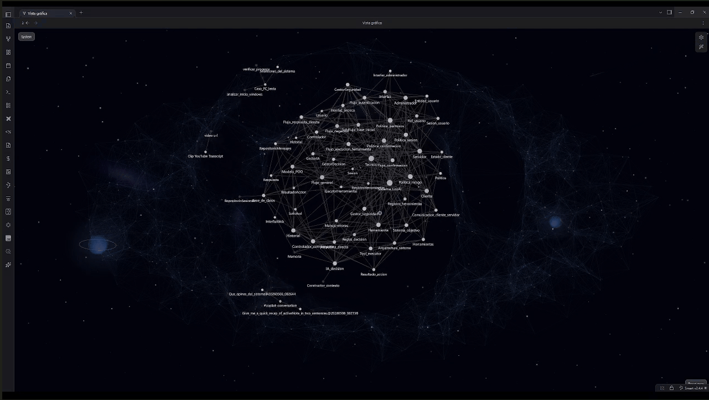
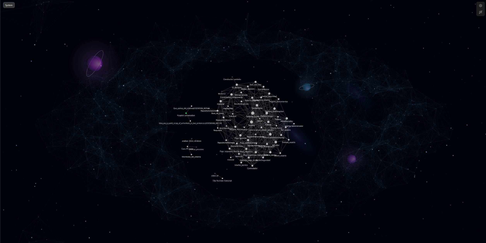
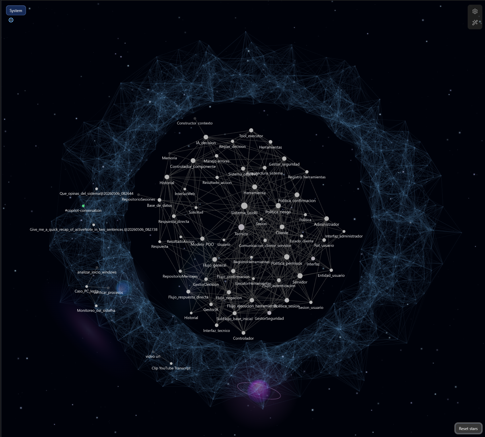
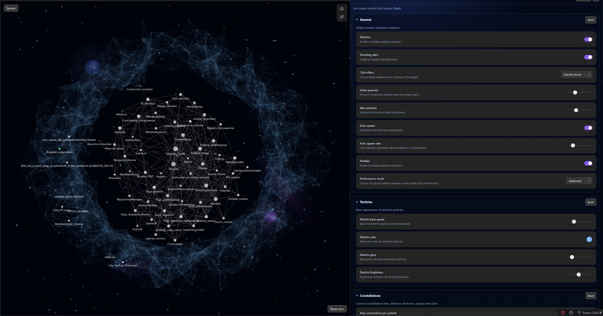

# Cosmos Graph

Transform the Obsidian Graph into a living cosmic visualization.


---

**Cosmos Graph** is an experimental visual plugin for Obsidian that transforms the Graph View into a dynamic cosmic environment using animated stars, particles, constellation-style connections, parallax depth and reactive visual effects.

Instead of feeling like a static diagram, the graph becomes something atmospheric and alive.

> Current status: **Alpha**

---

## Preview



---

## What Is Cosmos Graph?

Cosmos Graph is currently focused on enhancing the visual and atmospheric side of Obsidian’s Graph View.

The plugin adds:

- animated cosmic backgrounds,
- ambient particles,
- glowing constellation-like connections,
- parallax depth,
- interactive visual reactions,
- and cinematic movement effects.

The goal is to make the graph feel more immersive and expressive while still respecting the original Obsidian experience.

---

## Why?

The default Obsidian graph is functional, but visually static.

Cosmos Graph explores the idea of turning knowledge visualization into something:

- atmospheric,
- reactive,
- cinematic,
- emotionally expressive.

Instead of simply displaying connections, the graph becomes an interactive visual environment.

---

## Features

- Animated cosmic background.
- Far and near star layers.
- Ambient particle system.
- Dynamic constellation-style connections.
- Mouse-based parallax depth.
- Mouse glow and repulsion effects.
- Shooting stars.
- Radial, directional, and gravity click bursts.
- Interactive movement response.
- Reset visual state button.
- Custom settings panel.
- Performance warnings for very high visual settings.
- Desktop-only support.

---

## Screenshots

### Full Graph View



### Close View



### Settings Panel



---

## Installation

### From Obsidian Community Plugins

Once approved in the Obsidian community plugin directory:

1. Open **Settings -> Community plugins**.
2. Disable **Restricted mode** if needed.
3. Search for **Cosmos Graph**.
4. Install and enable the plugin.

### Manual Installation

1. Download the latest release.
2. Copy these files into your Obsidian vault:

```txt
.obsidian/plugins/cosmos-graph/
```

Required files:

```txt
main.js
manifest.json
styles.css
```

3. Restart Obsidian.
4. Open **Settings -> Community plugins**.
5. Enable **Cosmos Graph**.

### Development Installation

Clone the repository into your Obsidian plugins folder:

```bash
cd path/to/your/vault/.obsidian/plugins
git clone https://github.com/T3N0V4/cosmos-graph.git cosmos-graph
cd cosmos-graph
npm install
npm run build
```

Then enable the plugin inside Obsidian.

---

## Performance Notes

Cosmos Graph is currently in alpha and uses multiple animated canvas layers and real-time rendering systems.

Performance may vary depending on:

- particle count,
- connection density,
- background star density,
- graph size,
- screen resolution,
- device pixel ratio,
- GPU/browser performance.

If performance drops, try reducing:

- initial particles,
- max particles,
- connection distance,
- max connections per particle,
- background star counts.

Cosmos Graph also shows performance warnings in settings when expensive values are pushed very high.

---

## Current Limitations

Cosmos Graph is still experimental.

Known limitations:

- Some visual effects may be expensive on low-end devices.
- Very large graphs may reduce FPS.
- Some systems are still being optimized.
- Internal architecture is still evolving.
- Graph-aware logic is still limited.
- Desktop only.

---

## Roadmap

Planned ideas and future experiments:

- Better integration with real Obsidian graph nodes.
- Visual hierarchy based on note relevance.
- Different cosmic entities based on importance.
- Massive node structures such as stars, planets, and galaxies.
- Improved performance systems.
- Preset visual themes.
- Cinematic graph modes.
- Dynamic graph reactions.
- Better support for huge vaults.
- Cleaner internal graph architecture.

---

## Vision

Cosmos Graph started as a visual experiment, but the long-term idea is bigger than aesthetics alone.

Future versions may explore concepts such as:

- notes behaving like particles,
- important concepts becoming stars,
- major knowledge hubs evolving into massive cosmic structures,
- and graph relationships feeling more alive and organic.

The graph should not only display information.

It should feel alive.

---

## Release Files

GitHub releases should include:

```txt
main.js
manifest.json
styles.css
```

---

## Author

Created by **T3N0V4**.

---

## License

MIT License.

## Support

If you enjoy Cosmos Graph and want to support development:

☕ https://cafecito.app/T3N0V4
